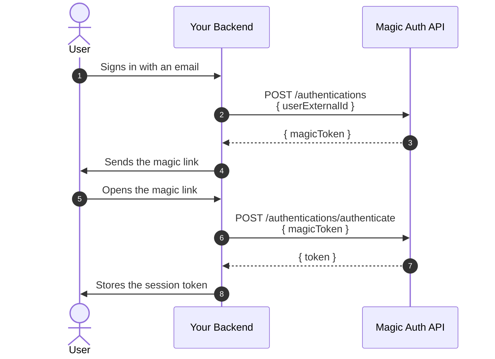

# Magic Auth API

**An API that handles Magic Link authentication.**

[](https://github.com/dusanmlynarcikdev/magic-auth-api/actions/workflows/publish.yml)
[](https://github.com/dusanmlynarcikdev/magic-auth-api/pkgs/container/magic-auth-api)

## How It Works

Magic Auth API is a standalone microservice. 
It runs alongside your backend, which communicates with it via a REST API.
It never talks to your users directly.

See the [Integration Flow](#-integration-flow) for how the user sign-in flow works.

## 📌 Main Highlights

- **Fast and modern stack (Node.js, NestJS)**
- **Simple to integrate and use**
- **Production-ready Docker image for `amd64` and `arm64`**
- **Deployable in minutes**

## Why Use Magic Auth API?

- No need to implement magic link authentication yourself
- Saves development time and effort
- Ensures a correct token handling
- Lets your team focus on the core product
- Helps ship your product faster

## Features

- Issues magic tokens for your magic links
- Exchanges magic tokens for session tokens
- Returns information about the signed-in user
- Identifies users by your own external IDs
- Does not store user data

---

## 🚀 Getting Started

### Production

1. Download the compose file and the environment file on the server:

   ```bash
   curl -fsSL -o docker-compose.yaml https://raw.githubusercontent.com/dusanmlynarcikdev/magic-auth-api/main/docker-compose.prod.yaml &&
   curl -fsSL -o .env https://raw.githubusercontent.com/dusanmlynarcikdev/magic-auth-api/main/.env.example
   ```

2. Point `DATABASE_URL` in `.env` to your PostgreSQL database

3. Run the migrations and start the published image:

   ```bash
   docker compose run --rm api npm run db:migrate &&
   docker compose up -d
   ```

#### Docker Compose Variables

| Variable       | Default  | Description                                      |
| -------------- | -------- | ------------------------------------------------ |
| `DATABASE_URL` | required | PostgreSQL connection string, loaded from `.env` |
| `API_VERSION`  | `latest` | Tag of the published Docker image                |
| `API_PORT`     | `8082`   | Port published on the host                       |

### Local

1. Clone the repository and create the environment file:

   ```bash
   git clone https://github.com/dusanmlynarcikdev/magic-auth-api.git &&
   cd magic-auth-api &&
   cp .env.example .env
   ```

2. Install the dependencies and run the migrations:

   ```bash
   docker compose run --rm api npm ci &&
   docker compose run --rm api npm run db:migrate
   ```

3. Start the API:

   ```bash
   docker compose up -d
   ```

> The API listens on http://localhost:8082 and reloads on every change.

## 🪄 API

Endpoints marked 🔒 require the session token in the
`Authorization: Bearer <token>` header.

| Method   | Path                            | Description                                             |
| -------- | ------------------------------- | ------------------------------------------------------- |
| `GET`    | `/health`                       | Returns `204` when the app is up                        |
| `POST`   | `/authentications`              | Creates an authentication, returns the `magicToken`     |
| `POST`   | `/authentications/authenticate` | Exchanges the `magicToken` for a session `token`        |
| `GET`    | `/authentications`              | 🔒 Lists the active authentications of the current user |
| `GET`    | `/authentications/me`           | 🔒 Returns the current authentication                   |
| `DELETE` | `/authentications/me`           | 🔒 Deletes the current authentication (sign out)        |
| `DELETE` | `/authentications/:id`          | 🔒 Deletes an authentication of the current user        |

> The magic token is valid for 10 minutes, the session token for 30 days.
> Expired authentications are deleted by a daily task.

## 🧵 Integration Flow

Your backend orchestrates the whole sign-in — it creates the authentication,
delivers the magic link and exchanges it for a session token.



---

## 👤 Author

**Dušan Mlynarčík** — Senior Backend Engineer

- LinkedIn: https://www.linkedin.com/in/dusanmlynarcik/
- GitHub: https://github.com/dusanmlynarcikdev
- Web: https://dusanmlynarcik.com
