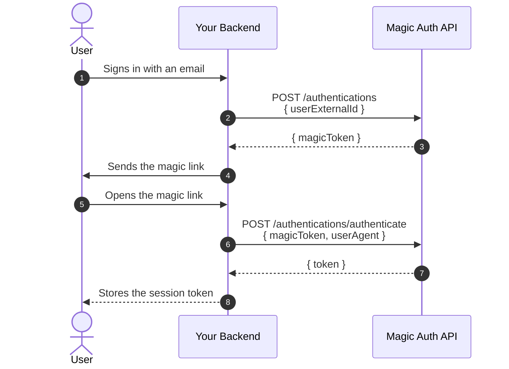
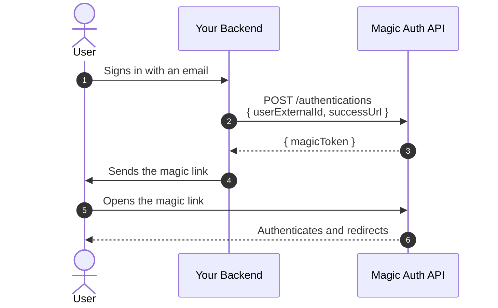

# Magic Auth API

**An API that handles Magic Link authentication.**

[](https://github.com/dusanmlynarcikdev/magic-auth-api/actions/workflows/publish.yml)
[](https://github.com/dusanmlynarcikdev/magic-auth-api/pkgs/container/magic-auth-api)

## How It Works

Magic Auth API is a standalone microservice.
It runs alongside your backend and exposes a REST API.

See the [Integration Flow](#-integration-flow) for how the user sign-in flow works.

## 📌 Main Highlights

- **Fast and modern stack (Node.js, NestJS)**
- **Simple to integrate and use**
- **Production-ready Docker image for `amd64` and `arm64`**
- **Deployable in minutes**

## Why Use Magic Auth API?

- No need to implement magic link authentication yourself
- Saves development time and effort
- Ensures a correct token handling
- Lets your team focus on the core product
- Helps ship your product faster

## Features

- Issues magic tokens for your magic links
- Exchanges magic tokens for session tokens
- Returns information about the signed-in user
- Identifies users by your own external IDs
- Does not store user data

---

## 🚀 Getting Started

### Production

1. Download the compose file and the environment file on the server:

   ```bash
   curl -fsSL -o docker-compose.yaml https://raw.githubusercontent.com/dusanmlynarcikdev/magic-auth-api/main/docker-compose.prod.yaml &&
   curl -fsSL -o .env https://raw.githubusercontent.com/dusanmlynarcikdev/magic-auth-api/main/.env.example
   ```

2. Set the variables in `.env` to your production values

3. Run the migrations and start the published image:

   ```bash
   docker compose run --rm api npm run db:migrate &&
   docker compose up -d
   ```

#### Docker Compose Variables

| Variable                 | Default  | Description                                                          |
| ------------------------ | -------- | -------------------------------------------------------------------- |
| `AUTHENTICATE_ERROR_URL` | `/`      | Where the authenticate page redirects when the magic link is invalid |
| `DATABASE_URL`           | required | PostgreSQL connection string                                         |
| `API_VERSION`            | `latest` | Tag of the published Docker image                                    |
| `API_PORT`               | `8082`   | Port published on the host                                           |

### Local

1. Clone the repository and create the environment file:

   ```bash
   git clone https://github.com/dusanmlynarcikdev/magic-auth-api.git &&
   cd magic-auth-api &&
   cp .env.example .env
   ```

2. Install the dependencies and run the migrations:

   ```bash
   docker compose run --rm api npm ci &&
   docker compose run --rm api npm run db:migrate
   ```

3. Start the API:

   ```bash
   docker compose up -d
   ```

> The API listens on http://localhost:8082 and reloads on every change.

## 🪄 API

Endpoints marked 🔒 require the session token in the
`Authorization: Bearer <token>` header.

| Method   | Path                            | Description                                             |
| -------- | ------------------------------- | ------------------------------------------------------- |
| `GET`    | `/health`                       | Returns `204` when the app is up                        |
| `POST`   | `/authentications`              | Creates an authentication, returns the `magicToken`     |
| `POST`   | `/authentications/authenticate` | Exchanges the `magicToken` for a session `token`        |
| `GET`    | `/authentications`              | 🔒 Lists the active authentications of the current user |
| `GET`    | `/authentications/me`           | 🔒 Returns the current authentication                   |
| `DELETE` | `/authentications/me`           | 🔒 Deletes the current authentication (sign out)        |
| `DELETE` | `/authentications/:id`          | 🔒 Deletes an authentication of the current user        |

> The magic token is valid for 10 minutes, the session token for 30 days.
> Expired authentications are deleted by a daily task.

## 🧵 Integration Flow

Your backend orchestrates the whole sign-in — it creates the authentication,
delivers the magic link and exchanges it for a session token.


```mermaid
sequenceDiagram
    autonumber
    actor User
    participant Backend as Your Backend
    participant API as Magic Auth API

    User->>Backend: Signs in with an email
    Backend->>API: POST /authentications<br/>{ userExternalId }
    API-->>Backend: { magicToken }
    Backend->>User: Sends the magic link
    User->>Backend: Opens the magic link
    Backend->>API: POST /authentications/authenticate<br/>{ magicToken, userAgent }
    API-->>Backend: { token }
    Backend-->>User: Stores the session token
```

> Your backend doesn't have to implement the authentication logic (steps 5–8) —
> see the [Authenticate Page](#-authenticate-page).

> To check whether the user is signed in, call `GET /authentications/me`
> with the session token — it returns the current authentication, or `401`
> when the token is invalid or expired.

## 🔗 Authenticate Page

An optional, ready-to-use page that replaces the magic link handling in your
backend. Expose `GET /authenticate?magicToken=<token>` publicly on
your domain and point the magic link to it.


```mermaid
sequenceDiagram
    autonumber
    actor User
    participant Backend as Your Backend
    participant API as Magic Auth API

    User->>Backend: Signs in with an email
    Backend->>API: POST /authentications<br/>{ userExternalId, successUrl }
    API-->>Backend: { magicToken }
    Backend->>User: Sends the magic link
    User->>API: Opens the magic link#8195;#8195;#8195;#8195;#8195;#8195;#8195;#8195;#8195;#8195;#8195;#8195;#8195;#8195;#8195;#8195;#8195;
    API-->>User: #8195;#8195;#8195;#8195;#8195;#8195;#8195;#8195;#8195;#8195;#8195;#8195;#8195;#8195;Authenticates and redirects
```

### Successful Sign-in

The page stores the session token in the `auth_token` cookie and redirects the
user to the `successUrl`.

The cookie is:

- `Secure` and `SameSite=Lax`
- Readable by both your server and JavaScript

### Invalid or Expired Link

The page stores nothing and redirects the user to the `AUTHENTICATE_ERROR_URL`.

> Both URLs are optional and default to `/`. They can be a path
> or an absolute URL with the `https` scheme.

---

## 👤 Author

**Dušan Mlynarčík** — Senior Backend Engineer

- LinkedIn: https://www.linkedin.com/in/dusanmlynarcik/
- GitHub: https://github.com/dusanmlynarcikdev
- Web: https://dusanmlynarcik.com
